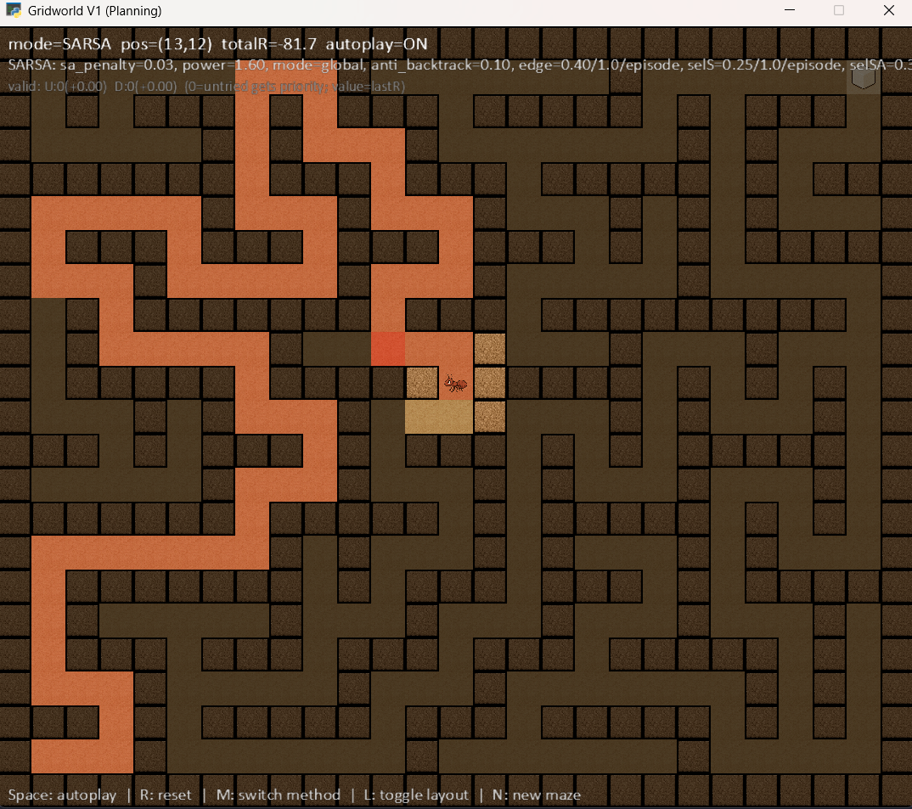

<p align="left">
  
  
  
  
</p>

Little Ant in the Maze is a small Reinforcement Learning sandbox in a 2D Gridworld. A tiny "ant" must find the exit (goal) while avoiding walls. The environment supports both a corridor layout and procedurally generated mazes. You can switch between planning methods (Value Iteration, Policy Iteration) and learning by interaction (SARSA), with a real‑time visual interface.

## 🎮 Overview

- Deterministic 2D grid with borders and interior walls.
- States are discrete positions `(x, y)`; actions are `UP`, `DOWN`, `LEFT`, `RIGHT`.
- Rewards:
  - `step`: per‑step cost (negative).
  - `goal`: reward when reaching the goal.
  - `collision`: cost when bumping into a wall/border.
- Episodes end when reaching the goal or exceeding `max_steps`.
- Toggle layout between "corridor" and "maze"; generate new mazes at any time.
- Methods:
  - VI (Value Iteration) and PI (Policy Iteration) compute optimal policies from the model.
  - SARSA trains an on‑policy controller, with optional shaping and novelty‑biased exploration.

## 🎯 Goals

Teach the agent to:
- Reach the goal with minimal cost/time.
- Navigate mazes with walls and changing layouts.
- Compare planning (VI/PI) vs. learning (SARSA) in a visual environment.

## ⚙️ Environment dynamics

- Configurable grid (`cols`, `rows`) with interior walls and borders.
- Start position (`start`) and goal (`goal`) inside the grid’s interior.
- Adjustable rewards for `step`, `goal`, and `collision`.
- Discount factor `gamma` exposed to both planning and learning methods.

## 🧠 Strategies

### Value Iteration (VI)
- Solves Bellman optimality over all interior states.
- Produces a greedy policy with respect to the converged values.

### Policy Iteration (PI)
- Alternates between policy evaluation and policy improvement until stable.

### SARSA (on‑policy)
- Learns Q(s,a) by interacting with the environment.
- Supports:
  - Orientation‑augmented state (includes previous action in the state).
  - State‑action repeat penalties (goal‑free shaping).
  - Anti‑backtrack penalty (avoid trivial back‑and‑forth).
  - Edge repeat cost (discourage oscillations).
  - Selection‑time novelty bias for states/state‑actions (prefer unseen).

## ✨ Features

- Real‑time UI built with `arcade` 3.x.
- Floor, wall, exit tiles and an actor sprite.
- Per‑cell visit heatmap (translucent red).
- Fog‑of‑war in SARSA mode (reveals nearby/visited cells).
- Overlays with:
  - Position, accumulated reward, and mode (VI/PI/SARSA).
  - Active SARSA parameters (shaping/novelty) and last penalty.
  - Per‑state/action debug line (tries, last reward).
- Keyboard shortcuts to toggle autoplay, method, layout, and spawn new maze.

## 🗂️ Project structure

```
RL-Little-Ant-in-the-Maze/
├── README.md
├── LICENSE
├── assets/
│   └── images/
│       ├── actor.png
│       ├── exit.png
│       ├── floor.png
│       ├── wall.png
│       └── project_preview.png
├── config/
│   ├── gridworld_v1.json         # environment config (grid, layout, rewards, method)
│   └── methods/
│       └── sarsa.json            # SARSA hyperparameters and shaping/novelty knobs
├── requirements-312.txt          # Python 3.12 env (Arcade 3.x + NumPy 2.x)
├── scripts/
│   └── gridworld_v1_arcade.py    # UI entry-point
└── src/
    ├── agents/
    │   ├── policy_iteration.py
    │   ├── sarsa.py
    │   └── value_iteration.py
    ├── engine/
    │   └── gridworld_renderer.py # Arcade window (rendering/UX)
    └── envs/
        └── gridworld_v1.py       # Gridworld V1 environment logic
```

## Requirements

- Python 3.10+ (3.12 recommended)
- Dependencies (3.12):
  - `requirements-312.txt`:
    - `arcade==3.0.0`
    - `numpy>=2.0,<3`

## Setup (PowerShell at repo root)

```powershell
python -m venv .venv
.\.venv\Scripts\Activate.ps1
# For Python 3.12
pip install -r requirements-312.txt
```

Optional (pyenv‑win + Python 3.12.10):
```powershell
git --version
# If missing: winget install Git.Git

Invoke-WebRequest -UseBasicParsing -Uri "https://raw.githubusercontent.com/pyenv-win/pyenv-win/master/pyenv-win/install-pyenv-win.ps1" -OutFile "./install-pyenv-win.ps1"; &"./install-pyenv-win.ps1"
# reopen PowerShell
pyenv --version

pyenv install 3.12.10
pyenv local 3.12.10
python --version

python -m venv .venv
.\.venv\Scripts\Activate.ps1
python -m pip install --upgrade pip
pip install -r requirements-312.txt
```

## ▶️ Run

Main UI:
```powershell
python -m scripts.gridworld_v1_arcade
```

The UI loads `config/gridworld_v1.json`, applies the configured method (`method`: `vi` | `pi` | `sarsa`), and if `sarsa` is selected, reads hyperparameters from `config/methods/sarsa.json` when available.

## ⌨️ Controls (window)

- Space: toggle autoplay ON/OFF
- R: reset episode (rebuild overlays/heatmap and reposition actor)
- M: switch method (VI → PI → SARSA → VI)
- L: toggle layout (corridor ↔ maze)
- N: new maze (procedural)

Note: in SARSA mode, training may be triggered internally by the UI; overlays show status and the "last penalty".

## ⚙️ Configuration (examples)

`config/gridworld_v1.json`:
```json
{
  "grid": {
    "cols": 27,
    "rows": 23
  },
  "start": [1, 1],
  "goal": [25, 21],
  "randomize_start_neighbors": false,
  "max_steps": 400,
  "layout": "corridor",
  "method": "vi",
  "method_config": "config/methods/sarsa.json",
  "rewards": {
    "step": -1,
    "goal": 10,
    "collision": -5
  },
  "gamma": 0.95,
  "rng_seed": 123
}
```

`config/methods/sarsa.json`:
```json
{
  "episodes": 600,
  "alpha": 0.5,
  "epsilon": 0.8,
  "epsilon_min": 0.05,
  "epsilon_decay": 0.992,
  "max_steps": 300,
  "state_action_repeat_penalty": 0.03,
  "state_action_repeat_penalty_power": 1.6,
  "state_action_repeat_penalty_mode": "global",
  "anti_backtrack_cost": 0.1,
  "use_orientation_state": true,
  "edge_repeat_cost": 0.4,
  "edge_repeat_cost_power": 1.0,
  "edge_repeat_cost_mode": "episode",
  "selection_state_novel_coeff": 0.25,
  "selection_state_novel_power": 1.0,
  "selection_state_novel_mode": "episode",
  "selection_sa_novel_coeff": 0.35,
  "selection_sa_novel_power": 1.0,
  "selection_sa_novel_mode": "episode"
}
```

Tip:
- Set `layout` to `"maze"` for procedural mazes and press `N` to generate a new one.
- Change `method` to `"sarsa"` to train a policy with the shaping/novelty options above.

## 📚 References

- Sutton & Barto — Reinforcement Learning: An Introduction (planning and control chapters).
- Classic materials on Value/Policy Iteration and SARSA.
- Arcade 3.x documentation for building 2D UIs.

## 📝 License

This project is released under The Unlicense (public domain). You may use, copy, modify, and distribute this software for any purpose.

See the `LICENSE` file for full text or visit [unlicense.org](https://unlicense.org).


